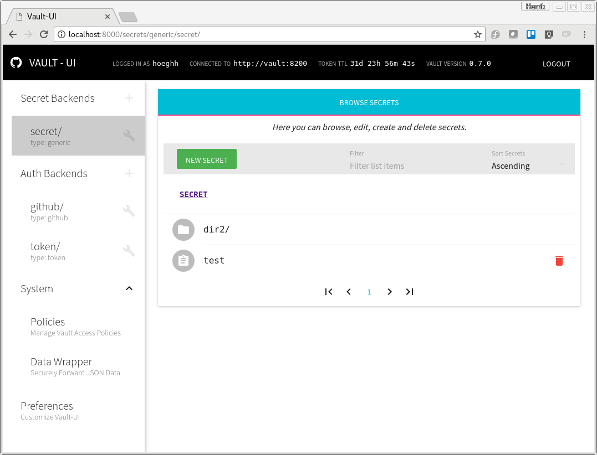

# Dockerhosting Vault
## Getting started

## A complete guide with Github Auth
First we need to create a Docker network for the containers to communicate by. Then we create a configuration file for Vault specifying a path to a file for persistant storrage and network settings. We can then start a container with wailt that mounts this configuration file. Then, we start the Vault-ui.

The script start-vault.sh does all of this, and prints out out config file and how to connect to Vault once running.

```
./start-vault.sh
```

The output is as following :
```
Creating Docker network
ffc5c1c48e1c3d45804181874e35c756e8914dc1cc7378af7835a8c6a3a13833

backend "file" {
  path = "/vault/file/vaultsecrets"
}

listener "tcp" {
  address = "0.0.0.0:8200"
  #tls_cert_file = "/root/server.crt"
  #tls_key_file = "/root/server.key"
  tls_disable = 1
}

Starting Vault container in server mode...
7e27864765f2f77a346d810385ea2c70933591a92044ec78518f38cc681c1a2c
run :
docker exec -it vault /bin/sh
export VAULT_ADDR=http://127.0.0.1:8200
vault init

to init Vault and get keys

Starting Vault UI
eeef4eca7497c2799e916307930b911aaf564500380ada546305c1b82312bb39

```

We then get the following containers running :

```
docker ps
CONTAINER ID        IMAGE                 COMMAND                  CREATED              STATUS              PORTS                    NAMES
eeef4eca7497        djenriquez/vault-ui   "yarn run serve"         About a minute ago   Up About a minute   0.0.0.0:8000->8000/tcp   vault-ui
7e27864765f2        vault                 "docker-entrypoint..."   About a minute ago   Up About a minute   8200/tcp                 vault

```

> NOTE: The vault has not bound its port 8200 to the host, as we should use the UI. If you want to use the terminal, use the docker exec and do it inside the container.

## Setting  up Vault
```
docker exec -it vault /bin/sh
export VAULT_ADDR=http://127.0.0.1:8200
vault init
```
Vault will print out your tokens. You should save these a safe place. And back that safe place up.
The output will look like this :

```
Unseal Key 1: LvDAzudr+YKAwRfNyeKaQ5RSkTZpzHej1AszNQNKa+cB
Unseal Key 2: Bcwzcr7FVH7/f5T+26VgNmpK2mFUm3v9IirYG9P50z8C
Unseal Key 3: LipMVv2ESongW4Fd/jcmOD+Ke25jdgZwzXV2VOuGAV8D
Unseal Key 4: Ro1vrNZAkLY8r/NMbUR/PIguBYrBufL2VIUfaaZ+FBcE
Unseal Key 5: bWsQiJUBjkEji+bvSNY5Mt3upIX2VI97u9qxJp4BxncF
Initial Root Token: ec93ced0-9823-2e1b-ebbf-ca5038726d24

Vault initialized with 5 keys and a key threshold of 3. Please
securely distribute the above keys. When the Vault is re-sealed,
restarted, or stopped, you must provide at least 3 of these keys
to unseal it again.

Vault does not store the master key. Without at least 3 keys,
your Vault will remain permanently sealed.
```

Now run a ```vault status``` to see that its unsealed. If not, unseal it by running ```vault unseal``` with three keys given above. Then authenticate as root.
```
vault unseal LvDAzudr+YKAwRfNyeKaQ5RSkTZpzHej1AszNQNKa+cB
vault unseal Bcwzcr7FVH7/f5T+26VgNmpK2mFUm3v9IirYG9P50z8C
vault unseal LipMVv2ESongW4Fd/jcmOD+Ke25jdgZwzXV2VOuGAV8D
vault auth ec93ced0-9823-2e1b-ebbf-ca5038726d24
```

## Changing the default policy
Create a file inside the vault container with the command ```vi /vault/default-policy.hcl``` and put the following content in it.

```
path "*"{
    capabilities = [ "create", "read", "update", "delete", "list", "sudo" ]
}
path "auth/token/lookup-self" {
    capabilities = [ "read" ]
}

path "secret/*" {
  policy = "write"
}

path "sys/capabilities-self" {
    capabilities = [ "update" ]
}

path "sys/mounts" {
    capabilities = [ "read" ]
}

path "sys/auth" {
    capabilities = [ "read" ]
}
```
> NOTE : The above is not safe. The first entry should only be for Admins !

Then run the following to write the policy to the default policy.
```
vault policy-write default /vault/default-policy.hcl
```

## Setting up Vault for Github Auth.
Now we need to add Github as a backend authenticator. We will map the default policy to this. The policy is the one we just created.
```
vault auth-enable github
vault write auth/github/config organization=praqma
vault write auth/github/map/teams/default value=default
```

## Access Vault-ui in a browser
Open your favorite none-microsoft browser and head to [http://localhost:8000](http://localhost:8000)
Enter your github token and you should be logged in.



## Adding root key to Vault-ui
By default, secrets will display as their raw JSON value represented by the data field in the HTTP GET response metadata. However, users can apply a "Root Key" bias to the secrets through the settings page. The "Root Key" will be used when reading, creating and updating secrets such that the value displayed in the UI is the value stored at the "Root Key". For example, if the secret at secret/hello is { "value": "world" }, setting the "Root Key" to value will update the UI such that the secret will display as simply "world" instead of { "value": "world" }.

## Cleanup
If you want to remove Vault and Vault-ui, simply source ```cleanup.sh```.
```
hoeghh > Development > source cleanup.sh
vault
vault-ui
vault-network
```

## Future work
The Vault container does not have suficient volumes. We need to persist more paths to the host. 
